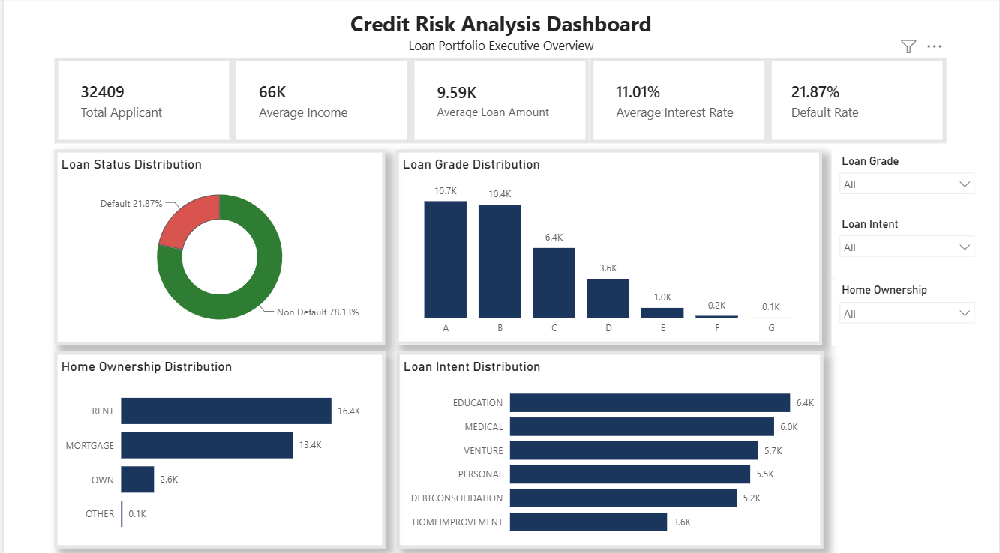
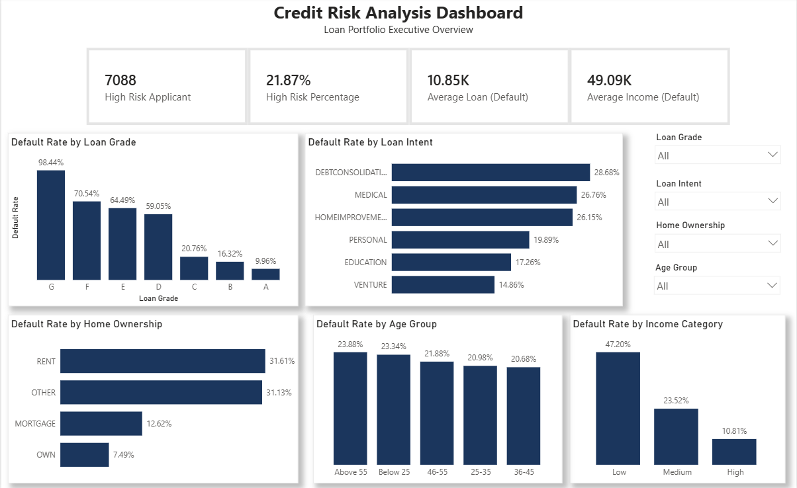

# 📊 Credit Risk Analysis

## 🎥 Project Walkthrough Video

Watch the video below for a complete walkthrough and detailed explanation of the **Credit Risk Analysis Dashboard** project.

👉 **[Click here to watch the full walkthrough on YouTube](https://youtu.be/vQi4ripyETw)**


## 📌 Project Overview

This project analyzes borrower data to identify factors associated with loan default risk. Using Python for data preparation, SQL for data storage, and Power BI for visualization, the project provides an interactive dashboard that helps stakeholders understand borrower characteristics and supports better credit decision-making.

---

## 🎯 Business Problem

Financial institutions need to minimize loan defaults while maintaining healthy loan approvals.

This project aims to answer several business questions, including:

- Which borrowers have the highest default risk?
- Does Loan Grade influence Default Rate?
- Which Loan Intent has the highest risk?
- How do Income, Home Ownership, and Age Group relate to loan default?

---

## 🛠️ Tools & Technologies

- Python
  - Pandas
  - NumPy
  - Matplotlib
  - Seaborn
- PostgreSQL
- Power BI
- Git & GitHub

---

## 📂 Project Workflow

```text
Business Understanding
        ↓
Data Cleaning
        ↓
Exploratory Data Analysis (EDA)
        ↓
Store Clean Data into PostgreSQL
        ↓
Power BI Dashboard
        ↓
Business Insights & Recommendations
```

---

## 📊 Dashboard Preview

### Executive Overview



---

### Credit Risk Analysis



---

## 💡 Key Insights

- Lower **Loan Grades** are associated with significantly higher **Default Rates** (Grade G highest, Grade A lowest).
- Borrowers applying for **Debt Consolidation** loans show the highest default risk, followed by Medical and Home Improvement intents.
- Applicants in the **Low Income** category experience substantially higher default rates compared to middle and high-income groups.
- Borrowers with **Rent** home ownership status tend to default more frequently than home owners.
- Younger borrowers (**Below 25 years old**) exhibit relatively higher default rates than older age groups.

---

## 📈 Business Recommendations

- **Loan Limit Restrictions:** Cap maximum loan amounts for high-risk borrowers in low Loan Grades (specifically Grades F and G) to minimize potential loss.
- **Enhanced Debt History Verification:** Require additional debt background checks for **Debt Consolidation** applicants before granting loan approval.
- **Combined Multi-Factor Credit Assessment:** Integrate Income, Home Ownership (Rent status), and Age Group (<25 years) as a unified risk matrix to identify and flag high-risk applicants early in the evaluation process.

---

## 📁 Project Structure

```text
Credit-Risk-Analysis/
│
├── data/
│   ├── raw/
│   └── cleaned/
│
├── notebooks/
│   ├── 01_Data_Understanding.ipynb
│   ├── 02_Data_Cleaning.ipynb
│   └── 03_Exploratory_Data_Analysis.ipynb
│
├── dashboard/
│   ├── Credit_Risk.pbix
│   ├── Overview_Page.png
│   └── Credit_Risk_Analysis_by_Default_Rate.png
│
├── reports/
│   └── Youtube_Video.md
│
├── README.md
└── LICENSE
```

---

## 📊 Dataset

- **Source:** Kaggle
- **Dataset:** Credit Risk Dataset

---

## 👨‍💻 Author

**Adnan**

Aspiring Data Analyst passionate about transforming raw data into actionable business insights using Python, PostgreSQL, and Power BI.

---
